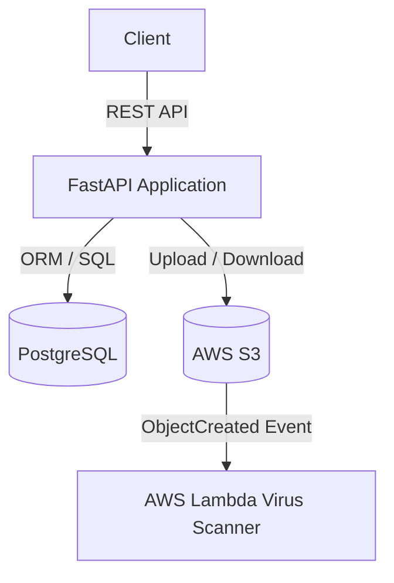

# EPOM — Effective PrOject Management

A REST API for creating, managing, and sharing projects with document attachments.
Built with **FastAPI** and **PostgreSQL**, fully containerized with Docker.

---

## Table of Contents

- [Tech Stack](#tech-stack)
- [Prerequisites](#prerequisites)
- [Quick Start](#quick-start)
- [Environment Variables](#environment-variables)
- [External Services Setup](#external-services-setup)
  - [AWS S3](#aws-s3)
  - [Resend (Email)](#resend-email)
- [Running Tests](#running-tests)
- [Make Commands](#make-commands)
- [Project Structure](#project-structure)
- [System Architecture](#system-architecture)
- [API Endpoints](#api-endpoints)
- [Limitations & Stub Features](#limitations--stub-features)

---

## Tech Stack

| Layer | Technology |
|---|---|
| Runtime | Python 3.12 |
| Framework | FastAPI |
| Database | PostgreSQL 16 |
| ORM / Migrations | SQLAlchemy 2 + Alembic |
| Auth | JWT (PyJWT) + Argon2 password hashing |
| File Storage | AWS S3 (boto3) |
| Email | Resend API |
| Containerization | Docker + Docker Compose |
| Testing | pytest + pytest-asyncio |
| Linting | Ruff |

---

## Prerequisites

Before you begin, make sure you have the following installed:

| Tool | Version | Install |
|---|---|---|
| Docker | ≥ 24 | https://docs.docker.com/get-docker/ |
| Docker Compose | ≥ 2 (plugin) | Bundled with Docker Desktop |
| Make | any | `sudo apt install make` / `brew install make` |
| Poetry | ≥ 1.8 | `pip install poetry` — **only needed to run tests locally** |

> **Note:** Poetry is only required if you want to run `make test` locally.
> The main app runs entirely inside Docker — no local Python installation needed.

---

## Quick Start

### 1. Clone the repository

```bash
git clone https://github.com/bonyvah/epom.git
cd epom
```

### 2. Create your environment file

```bash
cp .env.example .env
```

Open `.env` and fill in your real values. See [Environment Variables](#environment-variables) below for a full explanation of every variable.

### 3. Build and start

```bash
make build
```

This command:
- Builds the Docker image
- Starts `db` (PostgreSQL) and `api` (FastAPI) containers
- Automatically runs Alembic migrations on startup

### 4. Verify it's running

| URL | Description |
|---|---|
| http://localhost:8000/docs | Swagger UI (interactive API docs) |
| http://localhost:8000/health/live | Liveness probe |
| http://localhost:8000/health/ready | Readiness probe (checks DB connection) |

---

## Environment Variables

Copy `.env.example` to `.env` and fill in each value:

```dotenv
# ── Database ─────────────────────────────────────────────────────────────────
DATABASE_URL=postgresql+asyncpg://epom:epom@db:5432/epom
# Leave this as-is when running with Docker Compose.
# The "db" hostname matches the service name in docker-compose.yml.

# ── JWT Auth ─────────────────────────────────────────────────────────────────
SECRET_KEY=changemechangemechangemechangeme
# Generate a secure random key: python -c "import secrets; print(secrets.token_hex(32))"

ALGORITHM=HS256
# Signing algorithm for JWT tokens. HS256 is the default.

ACCESS_TOKEN_EXPIRE_MINUTES=60
# How long (in minutes) a JWT token is valid after login.

# ── App ───────────────────────────────────────────────────────────────────────
APP_ENV=dev
# Valid values: dev | prod | test

APP_URL=http://localhost:8000
# Base URL of the API. Used to build invitation links in emails.

# ── Email (Resend) ────────────────────────────────────────────────────────────
RESEND_API_KEY=re_your_api_key_here
# Get this from https://resend.com/api-keys

SENDER_EMAIL=onboarding@resend.dev
# The "From" address for invitation emails.
# Use "onboarding@resend.dev" for testing on the free Resend plan.

# ── AWS S3 ────────────────────────────────────────────────────────────────────
AWS_ACCESS_KEY_ID=YOUR_ACCESS_KEY_ID
AWS_SECRET_ACCESS_KEY=YOUR_SECRET_ACCESS_KEY
AWS_REGION=eu-central-1
# The region where your S3 bucket is located.

S3_BUCKET_NAME=your-bucket-name
# Must be globally unique. See AWS S3 setup below.
```

---

## External Services Setup

The app requires two external services: AWS S3 for file storage and Resend for sending email invitations.

### AWS S3

1. **Create an IAM user** in the [AWS Console](https://console.aws.amazon.com/iam/) with programmatic access.
2. Attach the `AmazonS3FullAccess` policy (or a scoped-down policy for the specific bucket).
3. Copy the **Access Key ID** and **Secret Access Key** into your `.env`.
4. **Create an S3 bucket**:
   - Go to [S3](https://s3.console.aws.amazon.com/) → **Create bucket**
   - Choose a unique name and a region (e.g., `eu-central-1`)
   - Keep **Block all public access** enabled (the app uses pre-signed URLs)
5. Set `S3_BUCKET_NAME` and `AWS_REGION` in your `.env` to match.

> **Tip:** If you just want to run and test the API without real uploads, you can leave the AWS credentials as placeholders — document upload endpoints will return errors but the rest of the API will work fine.

### Resend (Email)

1. Sign up at [resend.com](https://resend.com) — the free plan is enough for local testing.
2. Go to **API Keys** → **Create API Key** and paste it as `RESEND_API_KEY`.
3. For local testing, use `SENDER_EMAIL=onboarding@resend.dev` (Resend's shared test address — no domain verification needed).
4. To send to any recipient in production, [verify your own domain](https://resend.com/domains) and update `SENDER_EMAIL`.

> **Tip:** Email sending is only triggered by the `/project/{id}/share` endpoint. You can skip this setup and still use all other endpoints.

---

## Running Tests

Tests use a separate `db_test` PostgreSQL container (port 5433) — no manual setup needed.

**Prerequisites:** Poetry must be installed locally (`pip install poetry`).

```bash
# Run the test suite
make test

# Run with coverage report (must be ≥ 80% or it fails)
make test-cov
```

Under the hood, `make test`:
1. Starts the `db_test` container
2. Runs `poetry run pytest` against `tests/`

---

## Make Commands

| Command | Description |
|---|---|
| `make build` | Build images and start all services (first-time setup) |
| `make up` | Start services without rebuilding |
| `make down` | Stop and remove containers |
| `make logs` | Tail live container logs |
| `make shell` | Open a shell inside the running API container |
| `make test` | Run the pytest test suite (requires Poetry) |
| `make test-cov` | Run tests with a coverage report (requires Poetry) |

---

## Project Structure

```
epom/
├── app/                    # Application source code
│   ├── main.py             # FastAPI app entry point + health endpoints
│   ├── config.py           # Settings loaded from .env via pydantic-settings
│   ├── database.py         # Async SQLAlchemy engine & session factory
│   ├── dependencies.py     # FastAPI dependency injection (DB session, current user)
│   ├── models/             # SQLAlchemy ORM models
│   ├── schemas/            # Pydantic request/response schemas
│   ├── routers/            # Route handlers (auth, projects, documents)
│   ├── services/           # Business logic (auth, project, document)
│   └── utils/              # Helpers (S3 client, email, token generation)
├── alembic/                # Database migration scripts
├── lambda/
│   └── handler.py          # AWS Lambda stub for virus scanning simulation
├── tests/                  # pytest test suite
├── Dockerfile              # Multi-stage build for the API container
├── docker-compose.yml      # Defines: api, db (PostgreSQL), db_test
├── entrypoint.sh           # Runs `alembic upgrade head` then starts the server
├── Makefile                # Convenience commands
├── pyproject.toml          # Project metadata, dependencies, tool config
├── tox.ini                 # Tox config for CI (pytest + ruff lint)
└── .env.example            # Template for environment variables
```

---

## System Architecture



---

## API Endpoints

| Endpoint | Method | Description |
|---|---|---|
| `/auth` | `POST` | Register a new user |
| `/login` | `POST` | Log in and receive a JWT token |
| `/projects` | `GET` | List the authenticated user's projects |
| `/project` | `POST` | Create a new project |
| `/project/{id}/info` | `GET` | Get project details |
| `/project/{id}/info` | `PUT` | Update project details |
| `/project/{id}` | `DELETE` | Delete a project |
| `/project/{id}/invite` | `POST` | Invite a user directly by their user ID |
| `/project/{id}/share` | `POST` | Send an email invitation link via Resend |
| `/join` | `GET` | Join a project via a share token (from email link) |
| `/project/{id}/documents` | `GET` | List documents in a project |
| `/project/{id}/document` | `POST` | Upload a document to a project (stored in S3) |
| `/document/{id}` | `GET` | Get a pre-signed S3 download URL for a document |
| `/document/{id}` | `PUT` | Rename a document |
| `/document/{id}` | `DELETE` | Delete a document |
| `/health/live` | `GET` | Liveness probe |
| `/health/ready` | `GET` | Readiness probe (checks DB connectivity) |

All protected endpoints require a `Bearer <token>` header (JWT obtained from `/login`).
The interactive Swagger UI at `/docs` lets you authorize and test endpoints directly.

---

## Limitations & Stub Features

- **Virus Scanner Simulation**: The virus scanner (`lambda/handler.py`) is a demonstration stub.
  It randomly marks uploaded documents as `clean` or `quarantined` to simulate scanning behavior.
  It does **not** perform any actual content scanning.
  In a production setup this Lambda would be deployed to AWS and triggered by an S3 `ObjectCreated` event.