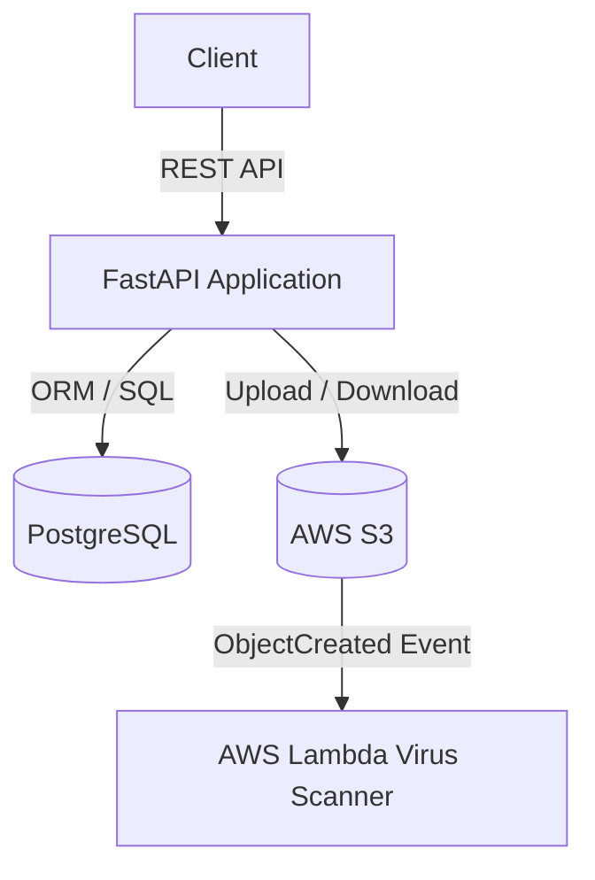

# EPOM — Effective PrOject Management

A REST API for creating, managing, and sharing projects with document attachments.
Built with FastAPI and PostgreSQL, fully containerized with Docker.

## Tech Stack

- **Python 3.12** / FastAPI
- **PostgreSQL 16**
- **SQLAlchemy 2** + Alembic
- **Docker** / Docker Compose

## Prerequisites

- [Docker](https://docs.docker.com/get-docker/)
- [Docker Compose](https://docs.docker.com/compose/)
- [Make](https://www.gnu.org/software/make/)

## Getting Started

**1. Set up environment variables**
```bash
cp .env.example .env
```
Open `.env` and fill in your values.

**2. Build and start**
```bash
make build
```

Migrations run automatically on startup. Once ready:

- **API**: http://localhost:8000
- **Swagger UI**: http://localhost:8000/docs

## Running Tests

```bash
make test
```

## Make Commands

| Command | Description |
|---|---|
| `make build` | Build images and start all services |
| `make up` | Start services without rebuilding |
| `make down` | Stop and remove containers |
| `make logs` | Tail live logs |
| `make shell` | Open a shell inside the API container |
| `make test` | Run the pytest test suite |
| `make test-cov` | Run the pytest test coverage |

## Limitations & Stub Features

- **Virus Scanner Simulation**: The virus scanner (implemented in `lambda/handler.py`) is a demonstration stub. It randomly clean-marks or quarantines uploaded documents to simulate scanning behavior, and does not perform actual contents scanning.

## System Architecture



## API Endpoints

| Endpoint | Method | Description |
|---|---|---|
| `/auth` | `POST` | Register user |
| `/login` | `POST` | User login (JWT) |
| `/projects` | `GET` | List user's projects |
| `/project` | `POST` | Create project |
| `/project/{id}/info` | `GET` / `PUT` | Get / Update project details |
| `/project/{id}` | `DELETE` | Delete project |
| `/project/{id}/invite` | `POST` | Invite user directly by ID |
| `/project/{id}/share` | `POST` | Email invitation link |
| `/join` | `GET` | Join project via token |
| `/project/{id}/documents` | `GET` | List project documents |
| `/project/{id}/document` | `POST` | Upload document |
| `/document/{id}` | `GET` / `PUT` / `DELETE` | Download (URL) / Rename / Delete document |